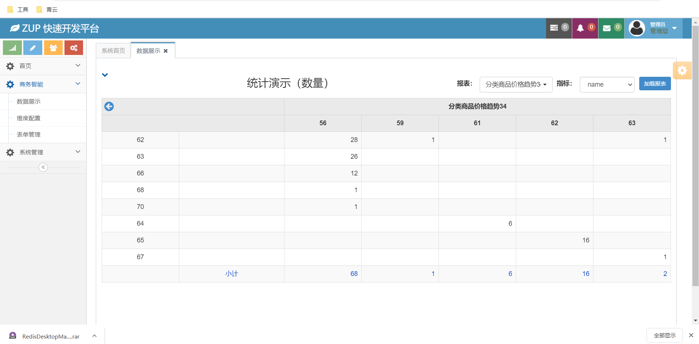
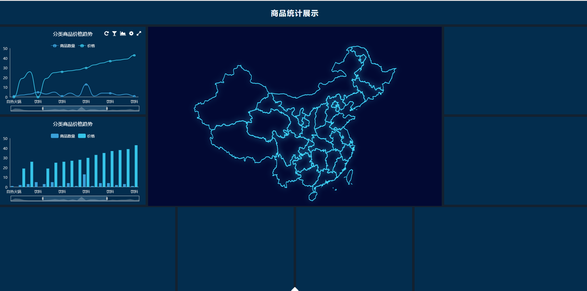
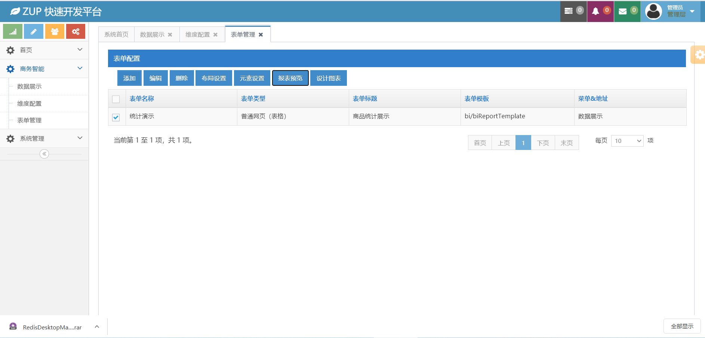
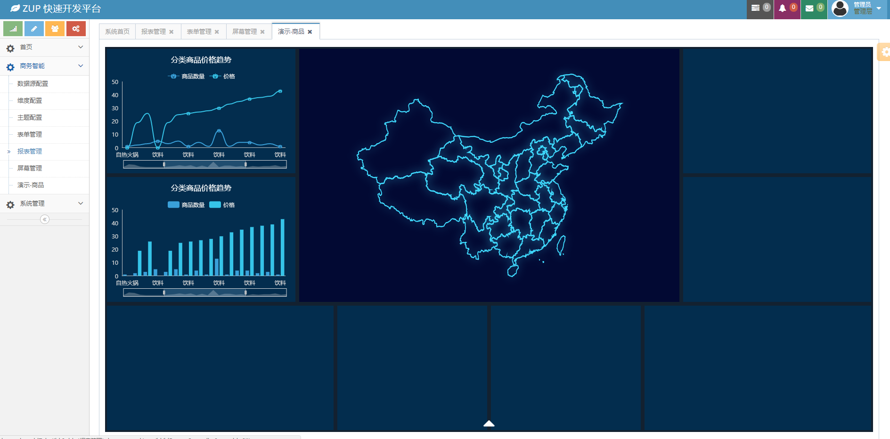

## ZUPBoot

### 信息化软件统一开发平台。

> 基于SpringBoot+SpringMVC+Mysql进行开发，包括功能

#### 1. 组织结构

#### 2. 权限管理

#### 3. 微信公众号管理

#### 4. 工作流

#### 5. BI可视化

### 基础准备

1. 配置Maven环境

推荐3.5或3.6版本

1. 配置Mysql环境

推荐5.5、5.6、5.7版本

### Use desc

> 1. git clone https://github.com/zonedaylab/zup-boot.git

> 2. Open project in Idea & Eclipse

> 3. 在项目中查找 zup-boot/src/main/resources/sql/zup.sql & zupwf.sql & bi-demo
导入到MySQL数据库中（MySQL数据库支持5.6及以上版本，不要高于5.7）
      导入SQL文件：mysql -u root -p 123456 < zup.sql
      导入SQL文件：mysql -u root -p 123456 < zupwf.sql
      或者直接在数据库管理工具中直接导入（推荐Navicat、SQLyog）

> 4. 右键zup-boot\src\main\java\cn\zup\ZupApplication.java Run Application

> 5. Chrome 游览器打开localhost:8094
>     用户名 admin  密码 123456

> 6. 如果想要体验BI，请再导入一个数据库zup-boot/src/main/resources/sql/bi-demo.sql

数据库配置文件：
zup-boot\src\main\resources\application.yml

zup-boot\src\main\resources\application-demo.yml

zup-boot\src\main\resources\application-nature.yml

### 注意

若不是Maven项目，将项目认定为Maven项目

在跳转出来的页面中勾选Maven选项

### 演示图片
#### 点击进入查看大屏展示页面

#### 查看维度配置页面

#### 表单管理

#### 报表预览点进去的

####BI说明
配置菜单，自动生成跳转页面  BI/MenuSHow ？ menuID= 对应报表ID。  
BIShowPageController.java的函数：
@RequestMapping("/MenuShow")
BI/BIReportTemplate.jsp