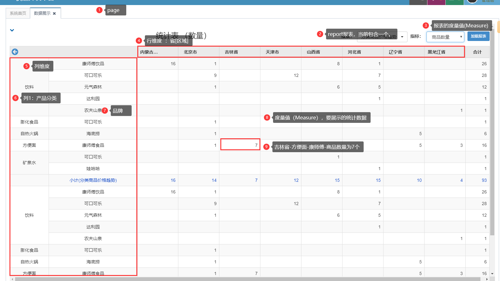

#### 1.业务说明


1. ##### 维度的排列说明

    * 列维度:纵向排列    
    * 例如 dimName="省份" dimValue=山东省/河南省/....
        + 纵向排列：    
        + 山东省
        + 河南省
        + 河北省
        + ......

     * 行维度，例如by liuxf
         * dimName=行业种类
         * dimValue= 电力/ 服务/水务等
         * 维度横向生成
         * 电力 服务   水务   。。。。。。

2. ##### GenerateTableRows根据列维度生成行信息,返回值listRows<String>

   ```
   private void GeneTableRows(int dimCol, List<BIDimData> BIColDimDatas , String colsNames, int colSize, List<String> listRows)
   ```

   返回值为listRows，为总共要生成的行的数量，每列的信息格式为  dim1name,dim2name,dim3name,..

   例如维度为dim1 省份（山东省，河南省，河北省...)，dim2 矿类（金属，煤矿）

|        |              |                     |
| ------ | ------------ | ------------------- |
| 第一行 | 山东省，金属 | listRows<String>[0] |
| 第二行 | 山东省，煤矿 | listRows<String>[1] |
| 第三行 | 河南省，金属 | listRows<String>[2] |
| 第四行 | 河南省，煤矿 | listRows<String>[3] |
| 第五行 | 河北省，金属 | listRows<String>[4] |
| 第六行 | 河北省，煤矿 | listRows<String>[5] |
|        |              |                     |


2. GenerateTableCols 根据行维度生成列信息（多少列）

   ```
   private void GeneTableCols(int dimRow, List<BIDimData> BIRowDimDatas , String rowsNames, int rowSize, List<String> listCols)
   ```

   根据行维度生成列信息,返回值为listCols，为总共要生成的列的数量，每列的信息格式为  dim1name,dim2name,dim3name,....

* 例如行维度为 dim1类型（饮料 膨化食品 矿泉水），dim2品牌（可口可乐 哇哈哈），

|      | 第一列         | 第二列       | 第三列               | 第四列           | 第五列         |
| ---- | -------------- | ------------ | -------------------- | ---------------- | -------------- |
|      | 饮料，可口可乐 | 饮料，哇哈哈 | 膨化食品，可口可乐， | 矿泉水，可口可乐 | 矿泉水，哇哈哈 |
|      | listCols[0]    | listCols[1]  | listCols[2]          | listCols[3]      | listCols[4]    |
|      |                |              |                      |                  |                |

‘

mapIndicatorData   key,value ,
key为 维度信息   r1,r2...c1,c2   分别代表行维度 ，列维度的数据，
value为汇聚数据
例如（dimkey=山东省，集体企业，  value=5）


根据维度定义 表格的长度和宽度，假设行维度 4个数据，列维度为3个数据，则3行4列的表格。

#### 2.设计思路

##### 2.1 数据库设计

1. 一个页面，包括多个报表
   1. 一个报表就是一个表格或者图形，每个报表会对对应一个主题表（可以是一个视图或Table)
   
   2. 主题表的字段包括两种类型：维度[时间维度、区域维度、类型]、指标。
   
   3. 报表的字段与主题字段一一对应，有三种类型：行维度、列维度、指标
   
      
2. 一个页面，包括多个区块，区块和报表一一对应，用来表示报表的位置和宽度高度。其实可以和报表模板合并成一个。
3. 页面布局和区块通过屏幕索引进行对应。感觉也可以优化


拼接语句的例子（主题表+维度）

```
SELECT b.`PROVINCE_CODE_NAME`,c.`name` COUNT(a.`id`) FROM pms_product a  
JOIN v_dim_province b ON   a.`province_code`=b.`province_code`
JOIN dd_brand c ON a.`brand_id`=c.`id`
GROUP BY b.`PROVINCE_CODE_NAME` ,c.`name`
```


实际运行结果

```
SELECT 
dd_product_category.name AS product_category_id,
v_dim_province.PROVINCE_CODE_NAME AS province_code,
dd_brand.name AS brand_id, 
COUNT(pms_product.id) AS id 

FROM pms_product   
JOIN dd_product_category 
		ON pms_product.product_category_id = dd_product_category.id
JOIN v_dim_province ON pms_product.province_code = v_dim_province.province_code
JOIN dd_brand ON pms_product.brand_id = dd_brand.id WHERE 1=1 

GROUP BY product_category_id,province_code,brand_id;
```


##### 2.2 开发思路

1. 行维度、列维度只取其一能够展示.ok

1. 能够拼接多个报表进行展示
2. 多个报表块的查询时写入存在严重的问题，需要重构
3. 重构代码，加入图形展示、大屏展示、混合图表展示。
4. 能够拖拽维度展示

f. 钻取：钻取方式：

1.NONE
2.分段
3.路径

钻取信息：

	针对不同的钻取类型（在维度表中dim_table中drill_type），不同的配置如下：
	
	    1. ---------drill_type=DRILL_TYPE_NONE=1;   NONE-------------
		如: province维度对应的字符串： {山东省,河南省，河北省，山西省}
	
		2.---------drill_type=int DRILL_TYPE_SEG=2; 分段--------------
	
		3.---------drill_type=int DRILL_TYPE_PATH=3; 3.路径-----------
	
			在维度表中dim_table中，drill_info 配置 对应不同的维度字段，例如 province-city-country,表示对应维度表中不同的维度文本信息。
			dim_table 一般配置为  ：area (id ,province,city,country,name)
			构建的colName 如下
			[dim_data -  drill_name]
	
			example:
			[山东省 -  city] 表示当前需要从province 下转到city[drill_name], 下钻过滤语句为 '山东省'[drill_value ]
	
			当前的维度 字段序号
	
		4.---------drill_type=int DRILL_TYPE_DIFF_TOPIC=4;不同主题-----
	
		  a.维度配置：
	
		  针对维度字段，如果为不同的主题钻取，则drill_info 设置如下：
		  drill_info :     topicTable1,filterField1  -  topicTable2,filterField2  -  topicTable3,filterField3........
		  example:
		  v_fund_province, parent_code   -   v_fund_city ,province_code  -  v_fund_country  ,city_code.
	
		  点击山东省，则进行主题[topicTable2]的钻取,  filterField2表示主题的过滤字段。
		  dim_data 是text_code ,filter_condition是id_code.
		  例如 dim_data='山东省'  filter_condition='37'


		  b.根据配置生成前端格式数据。维度数据- 对应主题表
	
		  [dim_data - dim_name - current_topicTable_index] 分别对应维度数据，维度名字，当前主题表索引
	
		   --->exmaple  [山东省 - area_dim - 1]
	
		   dimName  topicTable
	
		 c.前端接收到维度配置信息
		   利用dim_data展示维度数据，
		   getList(dim_name - current_topic_index,  dim_data) 生成连接进行钻取。
	
		 d.前端发送请求
	
		   drill_name---->   dim_name - current_topic_index
		   					维度名称    -  当前主题表索引index；
		   					表示要钻取的维度；主题表索引index=0表示第一个主题表；index=1表示第二个主题表
		   drill_value----> dim_data    当前维度对应的数据值
	
	     e.后台接收后，构建查询语句 例如
	     
	 		 drill_name= 维度名称:主题表索引index； 表示要钻取的维度；主题表索引index=1表示第一个主题表；index=2表示第二个主题表
			 drill_value= 该维度对应的值；						 
			 后台接收后，构建查询语句 例如
			 drill_name="organ_code-1"
			 drill_value="山东省"			
		     drill_info :     topicTable1,filterField1  -  topicTable2,filterField2-topicTable3,filterField3........
			 NextTopicTableIndex=currentTopicTableIndex+1
			 通过dill_info ,NextTopicTableIndex获取  nextTopicTableName,nextFilterFied
			 过滤条件  filter_condition =drill_value=山东省
		  构建子主题查询：
		  select * from  [nextTopicTableName] where  [nextFilterFied]=[filter_condition]
	
		例如：
		  select * from  [view_city] where  [parent_provice]=[filter_condition]
	
		  只需要将主题序号插入到客户端就可以了()


当前的工作列表：
1. 主题设置能够设置固定字段的数据类型，进行判断是否需要对应维度表。如果维度字段为字符串，则需要的维度表id字段也为字符串，否则报错
2. 主题的字段能够拖拽，而不是弹出框进行添加，提高用户体验
3. 主题字段包括field_caption ,field_name ,field_caption，需要理清各自的用途
